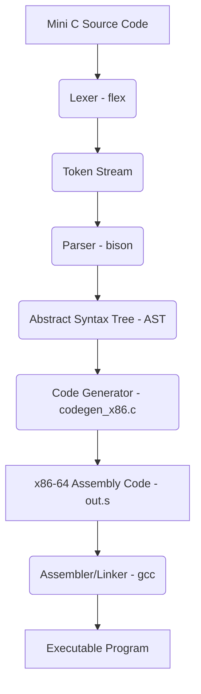

# Mini C Compiler Project Description

## 1. Language Overview and Design Intent

This project implements a Mini C compiler, a simplified subset of the C programming language. The primary design intent was to create a functional compiler capable of demonstrating fundamental compiler construction principles, including lexical analysis, parsing, abstract syntax tree (AST) generation, and x86-64 assembly code generation. The language aims to be simple yet powerful enough to express basic computational logic and control flow.

**Key characteristics of Mini C:**
-   **Statically Typed:** All variables must be declared with the `int` type.
-   **Procedural:** Supports function definitions and calls.
-   **Basic Control Flow:** Includes conditional statements (`if`, `if-else`) and loop constructs (`while`, `for`).
-   **Arithmetic and Comparison:** Supports standard arithmetic and comparison operations.

## 2. Grammar Definition

The grammar for Mini C is defined using a Bison grammar file (`parser/parser.y`). Below is a simplified EBNF-like representation of the grammar:

```ebnf
program         ::= func_list

func_list       ::= func_list function
                | function

function        ::= "int" IDENT "(" param_list_opt ")" compound_stmt

param_list_opt  ::= /* empty */
                | param_list

param_list      ::= "int" IDENT
                | param_list "," "int" IDENT

compound_stmt   ::= "{" stmt_list_opt "}"

stmt_list_opt   ::= /* empty */
                | stmt_list

stmt_list       ::= stmt_list stmt
                | stmt

stmt            ::= vardecl ";"
                | RETURN expr ";"
                | expr ";"
                | if_stmt
                | while_stmt
                | for_stmt

if_stmt         ::= IF "(" expr ")" compound_stmt
                | IF "(" expr ")" compound_stmt ELSE compound_stmt

while_stmt      ::= WHILE "(" expr ")" compound_stmt

for_stmt        ::= FOR "(" for_init_opt ";" for_cond_opt ";" for_increment_opt ")" compound_stmt

for_init_opt    ::= /* empty */
                | "int" IDENT
                | "int" IDENT "=" expr
                | expr

for_cond_opt    ::= /* empty */
                | expr

for_increment_opt ::= /* empty */
                | expr

vardecl         ::= "int" IDENT
                | "int" IDENT "=" expr

expr            ::= expr "+" expr
                | expr "-" expr
                | expr "*" expr
                | expr "/" expr
                | expr "==" expr
                | expr "!=" expr
                | expr "<" expr
                | expr ">" expr
                | expr "<=" expr
                | expr ">=" expr
                | IDENT "=" expr  // Assignment is an expression
                | primary

primary         ::= NUMBER
                | IDENT
                | IDENT "(" arg_list_opt ")"
                | "(" expr ")"

arg_list_opt    ::= /* empty */
                | arg_list

arg_list        ::= expr
                | arg_list "," expr
```

## 3. Overall Structure

The compiler follows a traditional multi-pass architecture:

1.  **Lexical Analysis (Lexer):** Implemented using `flex` (`parser/lexer.l`). It reads the Mini C source code and converts it into a stream of tokens (e.g., keywords, identifiers, numbers, operators).
2.  **Syntactic Analysis (Parser):** Implemented using `bison` (`parser/parser.y`). It takes the token stream from the lexer and builds an Abstract Syntax Tree (AST) based on the defined grammar. It also handles basic syntax error reporting.
3.  **Abstract Syntax Tree (AST):** Defined in `include/ast.h` and implemented in `src/ast.c`. The AST is an intermediate representation of the program's structure, abstracting away syntactic details.
4.  **Code Generation:** Implemented in `src/codegen_x86.c`. This pass traverses the AST and generates equivalent x86-64 assembly code (`out.s`). It manages local variables, function calls (using cdecl convention), and control flow constructs.
5.  **Main Driver:** `src/main.c` orchestrates the entire compilation process, from reading the input file to invoking the lexer, parser, and code generator.



## 4. Implemented Features and Unimplemented/Limitations

### Implemented Features:
-   **Variable Declaration and Initialization:** Supports `int` type variables with optional initialization (e.g., `int x;`, `int y = 10;`).
-   **Assignment:** Assignment is treated as an expression (e.g., `x = y + 5;`).
-   **Arithmetic Operations:** Addition (`+`), subtraction (`-`), multiplication (`*`), division (`/`).
-   **Comparison Operations:** Equality (`==`), inequality (`!=`), less than (`<`), greater than (`>`), less than or equal to (`<=`), greater than or equal to (`>=`).
-   **Conditional Statements:** `if` and `if-else` constructs.
-   **Loop Statements:** `while` loops and `for` loops (with optional initialization, condition, and increment parts).
-   **Function Definitions:** Supports user-defined functions returning `int` and taking `int` parameters.
-   **Function Calls:** Supports calling user-defined functions.
-   **Return Statements:** Functions can return integer values.

### Unimplemented/Limitations:
-   **Data Types:** Only `int` type is supported. No `char`, `float`, `double`, `void`, or custom data structures (structs, unions).
-   **Arrays and Pointers:** Not implemented.
-   **Global Variables:** All variables are local to functions.
-   **Input/Output:** No built-in functions for console I/O (e.g., `printf`, `scanf`).
-   **Advanced Control Flow:** No `break`, `continue`, `switch` statements.
-   **Error Handling:** Basic syntax error reporting from Bison. Semantic error checking (e.g., type checking, undeclared variables, function signature mismatches) is minimal or absent.
-   **Optimizations:** No compiler optimizations are performed.
-   **Scope Management:** Simple flat scope for local variables within a function. Nested scopes (e.g., within `if` or `for` blocks) are not fully managed with a stack-based symbol table, which could lead to issues with variable shadowing in more complex scenarios.
-   **Function Overloading:** Not supported.
-   **Recursion:** Not explicitly tested, but should work for simple cases as function calls are implemented.
